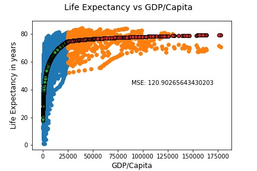
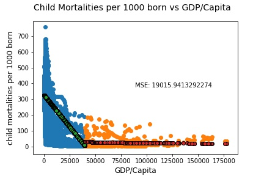

# DS5500_Homework2

## Problem 1: 

Link to the Piazza note. https://piazza.com/class/k05u5i0wc3w540?cid=194

## Problem 2:

I compared my visualization with Mrinal Soni's visualization for problem 2. 

Mrinal's visualization can be found here: https://github.com/mrinaaall/DS-5500/blob/master/InfoVizHW1.pdf.

My visualization can be found here: https://github.com/noahdemoes/DS5500_Homework1/blob/master/DS5500_Homework1.pdf.

### Similarities and Differences
Mrinal's visualization differs than mine in several ways. Mrinal used only one plot to answer the question. I needed 6 plots, one to show the change in GDP/capita for each region over time and 5 additional plots to capture GDP/captia as a function of time for all countries in each region. Mrinal reduced the continents into 4 regions while I kept the continents seperate. Mrinal also restricts the time period o 1960-2015 while I include results from 1800 to 2050.

We are similar in that we use the same visualization technique. We both had 3 variables of interest, GDP/Capita, time, and country/continent and utilized a two dimenisional, static plot to visualize our results. To capture the 3rd variable, region/country, we colored the line plot of the corresponding country.

#### Interpretable

Mrinal's visualization is easy to interpret the change in average country GDP over time for each world region. It is clear that the x-axis is the time variable, the y-axis is the Average Country GDP, and each of the color's represents a one of four different world regions. Although, easy to interpret it may be benefical to include the units for GDP. For example is the units on the y-axis representing dollars, thousands of dollars, millions of dollars, etc. 

### Effective

Mrinal's visualization does not effectively capture the entire intent of what is being asked because there is no way to determine for a specific country how that country's GDP/Capita changed over time. Mrinal's visualization is effective in capturing the Average Country GDP for each world region.

## Problem 3
I am comparing my results for problem 3 with Monica Mirsha's, which can be found here:
https://colab.research.google.com/drive/1v8EY74vQxPubjXHywpDUYo7a3FMj-GuB.

Mine are still found here: https://github.com/noahdemoes/DS5500_Homework1/blob/master/DS5500_Homework1.pdf.

### Similarities and Differences

Monica uses the same approach that I do and splits this problem into three plots, one for each of the variables in question, Life exceptancy, Child mortality, and GDP/Captia. Monica does better than me by including what the units are for the variable on the Y-axis. Monica worked un the google colab which includes more interactive features that my static plots do not provide.

### Interpretable

Monica's visualizations are highly interpretable. Each continent is clearly defined by a unique color. All titles and axis labels are included and are descriptive. 

### Effective

Monica's visualizations are highly effective in answering the questions because they include all necessary and relavant information that enables a view to quickly digest and understand the information presented.

## Problem 4

Code for problem 4 and 5 can be found here: 
[Problem 4 and Problem 5 code](https://github.com/noahdemoes/DS5500_Homework2/blob/master/DS5500_Homework2.ipynb)

I created 5 models. The first 4 models were a standard linear regression, ridge regression, lasso, and Elastic Net Model.

My performance metric was Mean Squared Error. The results for the four base line tests are listed below.

Linear Model MSE: 168.75964881746418
Ridge Model MSE: 168.90267101140435
Lasso Model MSE: 260.43751350274783
Elastic Net Model MSE: 259.8868309183112

I sought to improve these results and implemented a piecewise function. 

For GDP/Capita <= $25,000 the model was: predicted_y_below = 19*(np.log(x_below_25000/100)**.8)

For GDP/Capita > $25,000 the model was: predicted_y_above = 53*(np.log(x_above_25000/100)**.2)

The resulting MSE was 120. The resulting plot is shown below.

A piece-wise model made since in this context because the relative change in life expectancy did not change very much between varying levels of GDP/Capita. This may lead to one to conclude that $25,000 may be a reasonable estimation for a standard of living criteria. GDP/Capita less than $25,000 was volital and steep which is why the piece wise model made since in this context.

## Problem 5

Similar to my process in problem 4, I created 5 models. The first 4 models were a standard linear regression, ridge regression, lasso, and Elastic Net Model.

My performance metric was Mean Squared Error. The results for the four base line tests are listed below.

Linear Model MSE: 19162.129390028073
Ridge Model MSE: 19162.129390028254
Lasso Model MSE: 19162.130221430965
Elastic Net Model MSE: 19162.12940498447

I sought to improve these results and implemented a piecewise function. For GDP/Capita <= $40,000 the model was the results from the linear Model.

For GDP/Capita > $40,000 the model was: 700/x^.3.

The resulting MSE was 19000. The resulting plot is shown below.

Again my updated model performed better than the other base line models. This speaks again to the differences between GDP/capita and a corresponding minimum associated with livability. 

